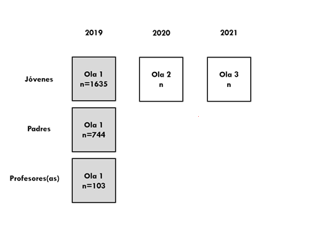

```{r eval=FALSE, include=FALSE}
# for render in pdf run rmarkdown::render_site("docs/preanalisis.Rmd", output_format = "all")
# clean #in the yml
library(citr)
rmarkdown::render("docs/preanalisis.Rmd", output_format = "bookdown::pdf_document2")
rmarkdown::render("docs/preanalisis.Rmd", output_format = "bookdown::html_document2")
```

```{r setup, include=FALSE}
knitr::opts_chunk$set(warning = FALSE,message = FALSE, cache = FALSE,out.width = '85%',fig.pos= "H")
# knitr::opts_knit$set(base.url = "../") #relative path for .html output file
# knitr::opts_knit$set(root.dir = "../") #relative path for chunks within .rmd files
options(scipen=999)
rm(list=ls())
options(knitr.kable.NA = '')
options(knitr.graphics.error = FALSE)
Sys.setlocale("LC_ALL", "ES_ES.UTF-8")
```

```{r message=FALSE, warning=FALSE, include=FALSE, echo=FALSE}
pacman::p_load(knitr, kableExtra, dplyr, lavaan)
```

```{r echo=FALSE }
table_format = if(is_html_output()) {
  "html"
} else if(is_latex_output()) {
  "latex"
}
table_format2 = if(is_html_output()) {
  T
} else if(is_latex_output()) {
  F
}
```

```{r eval=FALSE, echo=FALSE}
# Para obtener doble output (html/pdf) correr directamente en consola/terminal:
rmarkdown::render('production/index.rmd', output_format = 'all',output_dir = ".")
```

```{r include=FALSE}
#Determine the output format of the document
outputFormat   = knitr::opts_knit$get("rmarkdown.pandoc.to")

#Figure and Table Caption Numbering, for HTML do it manually
capTabNo = 1; capFigNo = 1;

#Function to add the Table Number
capTab = function(x){
  if(outputFormat == 'html'){
    x = paste0("Tabla ",capTabNo,". ",x)
    capTabNo <<- capTabNo + 1
  }; x
}

#Function to add the Figure Number
capFig = function(x){
  if(outputFormat == 'html'){
    x = paste0("**","Figura ",capFigNo,": ","**",x)
    capFigNo <<- capFigNo + 1
  }; x
}
```
Plantilla de preinscripción de AsPredicted.org


## ¿Se han recopilado ya datos para este estudio?
Los datos para este estudio fueron levantados mediante una encuesta aplicada en colegios entre agosto y diciembre del 2019. Los participantes del estudio son estudiantes (2° año educación media/secundaria), sus apoderados y profesores provenientes de la Región de Antofagasta (14 Establecimientos), la Región Metropolitana (35 Establecimientos) y la Región del Maule (15 Establecimientos). Hasta el momento solo se han realizado análisis descriptivos de la muestra, sin recurrir a análisis bivariados o a pruebas de hipótesis. 


## ¿Cuál es la pregunta principal o la hipótesis que se está probando en este estudio?
La percepción de meritocracia se refiere a una constatación u observación personal sobre el funcionamiento de la meritocracia en la sociedad, entendida como que los recursos se distribuyen en base a mérito (esfuerzo y talento). En el caso específico de este estudio el interés principal es analizar las percepciones de estudiantes de 2do medio en Chile en relación a dos agentes de socialización: la familia y la escuela. Las hipótesis son las siguientes.


- $H_1$ Padres con mayor percepción de meritocracia fomentan en sus hijos una mayor percepción de meritocracia.

- $H_2$. Los estudiantes que sienten que obtienen calificaciones justas en sus colegios poseen mayor percepción de meritocracia.

- $H_3$. El efecto de la percepción de meritocracia de los padres sobre la percepción de meritocracia de los estudiantes se verá moderado por su sentido de justicia en las notas. 

\pagebreak

## Describa la(s) variable(s) clave(s) especificando cómo se medirán.

Las variables más revelantes para el estudio se muestran a continuación:

```{r include=FALSE}
cap <- "Items de acuerdo a conceptos y tipo de variable."
# if (knitr::is_html_output()) {tb <- table_nums("tb",cap)} else {tb <- cap}
```

```{r table-indicadores, echo=FALSE}
tab01 <- read.csv(file = "input/other/table01.csv",header = 1,sep = ";",encoding = "UTF-8")
cnames <- c("Variable" , "Concepto", "Sujeto","Afirmación" , "Categorías de respuesta")
kable(tab01,table_format,booktabs = T, linesep = "",col.names = cnames, caption = cap) %>%
  kable_styling(
    full_width = T,
    latex_options = c("hold_position"),
    position = "center",
    font_size = 10,
    bootstrap_options=c("striped", "bordered")) %>%
  column_spec(column = 1, width = "1.5cm", ) %>%
  column_spec(column = 2,width = "2 cm") %>%
  collapse_rows(columns = 1:2,valign = "middle")
```

La variable dependiente de este estudio es la percepción meritocrática de los estudiantes. Esta se medirá a partir de dos indicadores, uno respecto a la opinión del éxito y el esfuerzo, y otro respecto a la importancia del trabajo duro. Ambos indicadores corresponden a escalas Likert de cuatro categorías, midiendo grado de acuerdo y grado de importancia, respectivamente.

Las variables independientes de este estudio pueden dividirse de acuerdo a si corresponden a padres o estudiantes. En el caso de los padres, los indicadores y categorías son idénticas a la variable dependiente. En el caso de los estudiantes, se utilizarán dos indicadores que buscan medir el sentido de justicia en las notas de. El primer indicador corresponde al reporte del estudiante sobre su nota promedio obtenida, y el segundo indicador corresponde al reporte sobre la nota esperada. A partir de estos indicadores se utilizará la formula de @jasso_New_1980 sobre la evaluación de justicia, siguiendo las aplicaciones al ámbito educativo por parte de @resh_Sense_2014, @resh_Sense_2017, @resh_Sense_2018. La formula corresponde al logaritmo natural de la proporción entre la recompensa obtenida y la recompensa justa, en este caso las notas:

$\text{Sentido de justicia en notas}= ln(\frac{\text{nota obtenida}}{\text{nota esperada}})$

\pagebreak

## Especifique exactamente qué análisis se realizará para examinar la pregunta / hipótesis principal

En vista de la estructura jerarquizada de la base de datos y considerando el nivel de medición ordinal de las variables se utilizarán regresiones logísticas ordinales multinivel. En base a las formalización de @arfan_Ordinal_2017 se propone el siguiente modelo general:

$log\left(\frac{Pr(Y_{ij}≤c)}{Pr(Y_{ij}>c)}\right)= a_c+\gamma_{1}Perc.MeritocraciaPadres_{ij}*\gamma_2SentidoJusticiaNotas_{ij}+\gamma_nControles_{ij}+u_{j}$


El modelo general representa el cálculo de la probabilidad acumulada de que un estudiante responda hasta $C$ en los indicadores de percepción de meritocracia, siendo $Y_{cij}$ una respuesta categórica ordenada de un estudiante $i^{th}$ en una escuela (cluster) $j^{th}$ con $C$ categorías ordenadas, codificadas como $C = 1,2,3,4$. Esta probabilidad se calcula en función de: el intercepto por cada categoría $a_c$, los coeficientes $\gamma_1$ y $\gamma_2$ para la percepción de meritocracia de los padres y el sentido de justicia en las notas respectivamente, $\gamma_n$ para las variables de control y $u_j$ como termino de error para una escuela $j$. Mediante la multiplicación entre $\gamma_1$ y $\gamma_2$, la formula expresa una interacción entre percepción meritocrática de los padres y el sentido de justicia en las notas, de modo tal que la fuerza transmisión de ideas meritocracias puede ser disminuida por experiencias como la sensación de injusticia en las notas. En suma, el modelo busca calcular la incidencia de la percepción meritocrática de los padres y el sentido de justicia en las notas, en la percepción meritocrática de los estudiantes.

La construcción del modelo general se hará por partes. El primer modelo solamente incluirá el coeficiente $\gamma_1$ para la percepción meritocrática de los padres. El segundo modelo añadirá $\gamma_2$ para controlar por el sentido de justicia en las notas. El tercer modelo corresponde al modelo general, añadiendo $\gamma_n$ para los controles y la interacción $\gamma_1*\gamma_2$. Este procedimiento se realizará para cada indicador de la percepción meritocrática de los estudiantes.

La correlación intra clase (ICC) para una variable dependiente ordinal se calculará siguiendo a (Snijder and Bosker en @arfan_Ordinal_2017:

$ICC = \frac{\tau_0}{\tau_0 + 3.29}$

Siendo $\tau_0$ el termino de error de la varianza de nivel dos, y 3.29 la varianza de una distribución logistica estandar.

El ánalisis se llevará a cabo con R version 4.0.3 "Bunny-Wunnies Freak Out", utilizando el paquete *mvord* desarrollado por @hirk_mvord_2020 para regresiones logísticas ordinales multinivel.

\pagebreak

## ¿Algún análisis secundario?

Como análisis de robustez de los modelos multinivel, se realizará la prueba d-cook para detectar casos influyentes, contrastando posteriormente la relación con y sin ellos. En la misma línea se calcularán los dfbetas para cada predictor. Con el mismo objetivo, compararemos los ajustes de los modelos multinivel con los mismos modelos pero con las variables centradas al promedio del grupo, para evaluar que el efecto que señalamos como individual no se deba al contexto de la escuela. 

## ¿Cuántas observaciones se recopilarán o que determinará el tamaño de la muestra? No es necesario justificar la decisión, pero sea preciso sobre cómo se determinará exactamente el número.

Utilizamos una muestra representativa de escuelas para encuestar estudiantes de segundo medio (n = 1635), padres (n = 744) y profesores (n = 103) en 3 regiones Chilenas: Antofagasta (14 Establecimientos), la Región Metropolitana (35 Establecimientos) y la Región del Maule (15 Establecimientos). La muestra es representativa de los distintos tipos de establecimientos (Particulares pagados, Particulares Subvencionados y Municipales). Del total de los casos que se estiman necesarios se superó el 90%, no obstante no se completó la muestra esperada.

La muestra del proyecto está diseñada como un seguimiento longitudinal tipo panel de tres olas (Figura 1), es decir, se busca volver a encuestar a los mismos estudiantes, aunque sin repetir la encuesta para padres y profesores. Este estudio utiliza los datos de la primera ola (2019) de forma transversal.

\pagebreak

## ¿Algo más que le gustaría inscribirse? (por ejemplo, exclusiones de datos, variables recopiladas con fines exploratorios, análisis inusuales previstos)

Para las regresiones multinivel, en miras del tamaño de la muestra se consideran significativas las relaciones con un p< 0,05. Para calcular el R2 de las relaciones se utilizara la técnicas de @bryk_Hierarchical_1992.  


###### Figura 1. Esquematización de muestreo por olas.

\pagebreak

## Referencias


